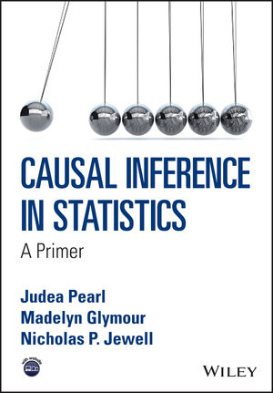
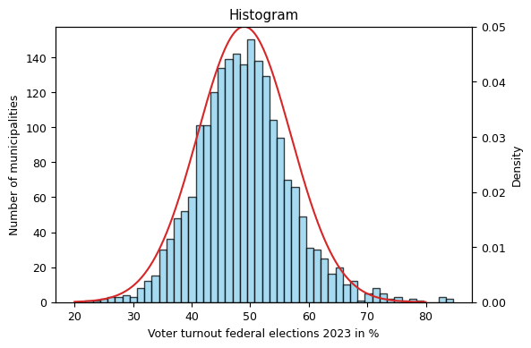
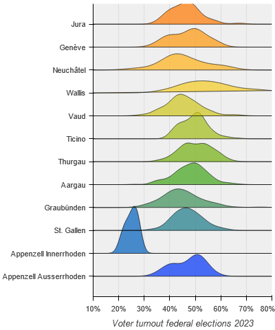
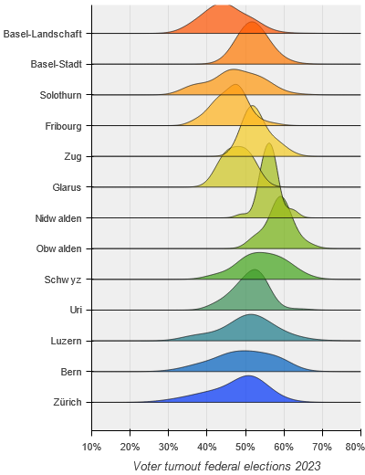
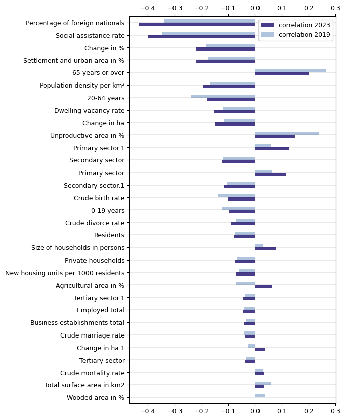
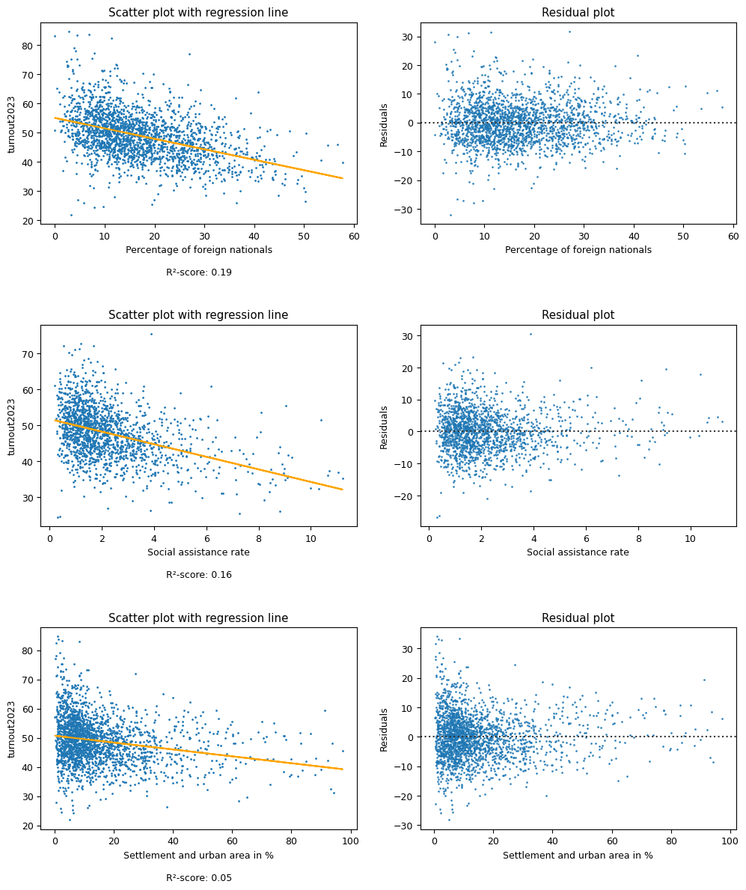
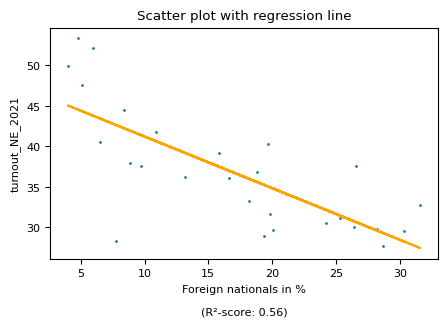
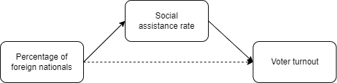
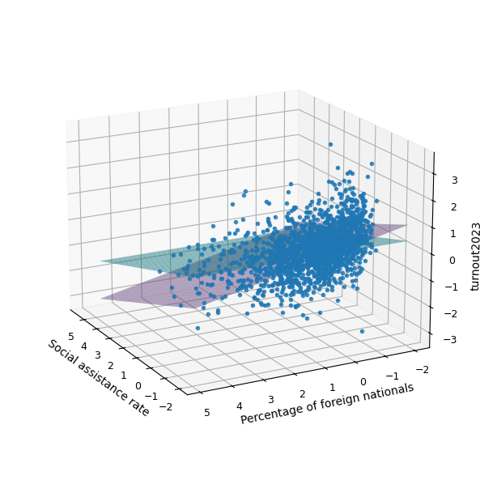

#  Voter turnout analysis of municipalities of Switzerland and some thoughts on causal inference

## Introduction

Switzerland has 2136 municipalities as of 1 January 2023, grouped into 26 Cantons. Federal elections are held every four years. For each election, the voter turnout (Wahlbeteiligung) is recorded by the Federal Statistical Office (FSO) for each municipality. The voter turnout is the proportion of the population entitled to vote that actually voted. Independent of that the Federal Statistical Office regularly collects data on each municipality like population size (residents) or the percentage of foreign nationals in a municipality. In this analysis, we merged multiple datasets and tried to find out if there are relations between voter turnout and other characteristics of the municipalities. The voter turnout from the Swiss federal election 2023 (National Council) is always considered as the main target variable $`Y`$ or $`Y_1`$. We will use the voter turnout from the Swiss federal election 2019 as a comparative value $`Y_2`$. The other data the FSO collects are considered as the input variables $`X_1, X_2, X_3... X_i`$. 

All sources (data and articles) are listed at the bottom of this article. In some sources, the municipalities are called communes. We consider those two terms as synonymous and use them interchangeably hereafter.

### Prerequisite knowledge

To follow this analysis you should be familiar with the following concepts. We will not explain them here since you will find many good teaching materials online.

- Mean, standard deviation and residuals
- Standardization of variables
- Normal distribution
- Kernel density estimation (Gaussian)
- Pearson correlation coefficient
- Histogram and Scatter plot
- Ordinary Least Squares regression (OLS)
- F-statistics

### Recommended readings

For those interested in causal inference, we recommend the following books:

<br>
<br>

<p align="center">
  
  
</p>

<br>
<br>

### Proceeding

1. Data retrieval
2. Data preprocessing
3. Exploratory data analysis
4. Identify correlations and relevant variables
5. Possible causal interpretations
6. Conclusions

### Used tools

This analysis was performed in a [jupyter notebook](./voter-turnout-in-switzerland.ipynb). Libraries like pandas, scipy, matplotlib, seaborn and bokeh were used.

### What we did not do
The focus of this analysis lies on the proceeding itself rather than on the actual outcome. We did not optimize a statistical or a machine learning model to make optimal predictions - since we have already the data of almost all municipalities there is not much to predict in this case. In return, we tried to find out how we could interpret the discovered correlations in terms of causal relationships.

## Data retrieval

We retrieved  the data from the following data sources:

1. Voter turnouts for the federal elections 2023 (opendata.swiss)
2. Voter turnouts for the federal elections 2019 (opendata.swiss)
3. Portraits of the communes (bfs.admin.ch)
4. Swiss official commune register (bfs.admin.ch)
5. Statistiques des élections cantonales du 18 avril 2021 (ne.ch)

All links to the data sources can be found in the [References](#data-sources) section. To ensure the traceability of this analysis, all data files were stored in the *data/original* directory of this repository. The *Swiss official commune register* we only used to assign the municipalities to the cantons.


## Data preprocessing

The preprocessed data files are in the directory *data/preprocessed*. 
These files (CSV) are used for the analysis. We performed the following tasks:

- Delete data entries not needed for the analysis. The file with the portraits of the communes contained several variables describing the voting behavior concerning specific political parties. However, these values were not available for numerous municipalities. To simplify the analysis, we deleted these variables and focussed on the more than 30 remaining variables.
- Replace "X" and "\*" characters which indicated missing values with empty values. This leads to *NaN* values in Python which are easier to handle.
- Harmonize some municipality's names since the FSO used different spellings in some cases
- Save all standardized values in a separate data frame so that variables that are on different scales can be compared with each other. See also the article *Common pitfalls in the interpretation of coefficients of linear models* on scikit-learn.org.

Finally, all files are merged:
```
data = pd.merge(municipalities, turnouts2023, on='Municipality', how='inner')
data = pd.merge(data, turnouts2019,           on='Municipality', how='left')
data = pd.merge(data, turnoutsNE,             on='Municipality', how='left')
data = pd.merge(data, commune_register,       on='Municipality', how='left')
```

### Missing values

The prepared data set contains now 2128 municipalities for which we have the voter turnout for 2023. 
Unfortunately, we are facing missing values among the input variables. Two examples:

| Input variable                  | Number of missing values    | Number of non-missing values   | Total    | 
| ------------------------------- | --------------------------- | ------------------------------ | -------- |
| Social assistance rate          | 460                         |    1668                        | 2128     | 
| Business establishments total   | 279                         |    1849                        | 2128     | 

We did not estimate the missing values (data imputation). We use the data provided by the Federal Statistical Office.

## Exploratory data analysis

### General remarks

Let's look at the data. What are we actually looking at? 
We have more than 30 variables from which the *Voter turnout* is considered as our target variable. 
The other variables are input variables that describe the municipalities like *Population density per km²* or the *Social assistance rate*. 
An overview of all variables you will find below in the bar chart. 
Detailed descriptions of these variables can be found on the website of the Federal Statistical Office. <sup>[[1]](#data-sources)</sup>

A certain inaccuracy in the analysis results from the fact that the portraits are from 2021 (the most recent data available) and the voter turnouts are from 2023. The characteristics of the municipalities may have changed slightly in the meantime. Several municipalities also merged between 2020 and 2023 and therefore a clear link between the two data sets is not always possible. We accept this but must take appropriate care when making interpretations.

### Voter turnouts

As we can see in the following histogram the voter turnouts are roughly normally distributed. 
The red line (normal distribution calculated from the mean and standard deviation of the data) is just plotted for visualization purposes.

<br>
<br>

<p align="center">
  
</p>

<br>
<br>

Next, we see a ridgeline plot showing the distributions of the voter turnouts of the municipalities per canton. The distributions were estimated from the data using the Gaussian kernel density estimator, weighted by the number of residents (scipy.stats.gaussian_kde). The plot gives an interesting overview, but in the following, we will not analyze the data per canton, but as a whole.

<br>
<p align="center">
  
  
  
</p>


### Input variables

A plot with histograms for all input variables you find in this repository: [Multi-plot with histograms](./plots/histogram-overview.png).

Among the variables, we find the following types:

- Percentage (0 to 100%) like the *Percentage of foreign nationals*
- Numbers (cardinal) like the number of *Private households*

Since there are no ordinal or nominal numbers and categorical variables we can use all input variables for calculations.

### Correlations

Let's see how each of the input variables $`X_i`$ correlates with the voter turnout 2023 $`Y_1`$. 
The voter turnout from 2019 $`Y_2`$ is used as a comparative value. 
For each tuple of variables $`(X_1,Y_1), (X_1,Y_2), (X_2,Y_1), (X_2,Y_2)... (X_i,Y_i)`$ the *Pearson correlation coefficient* was calculated. 
This coefficient is bounded by $-1$ and $1$ and indicates how well two variables correlate linearly, with a value of $1$ indicating a perfect positive correlation, $-1$ a perfect negative correlation, and $0$ no correlation at all. 
The variables are ordered by the absolute value of the correlation coefficient. 
With coefficients ranging from -0.43 to 0.2 we do in general not observe very strong linear correlations.

<br>
<br>

<p align="center">


<br>

### Linear regression

There is usually an interest in increasing voter turnout. 
So we focus on variables that are negatively correlated with voter turnout and see if we can find out more about them. 
Let's look at a scatter plot with a fitted regression line. 
Each point on the plot in the left column represents a municipality that is positioned on the plot according to its voter turnout and the variable mentioned on the horizontal axis. To assess the data a bit better, a residual plot is displayed on the right-hand side. The residual plot illustrates the differences between the actual data points and the linear regression line.

<br>

<p align="center">
  <a href="https://t4d-gmbh.github.io/voter-turnout-in-switzerland/scatterplot-2D-interactive/index.html">
    Interactive scatter plot with bokeh
  </a>
  <br/><br/>
  
  
</p>

As we can see there seems to be a trend in the data (the negative correlation mentioned before) but we can also see (on the label of the horizontal axis) that the R²-scores are quite poor. 
The R²-score ranges between 0 and 1 and is the proportion of the variation in the voter turnout which is explained by the regression model. 
This means that the regression line might indicate a trend but does not explain why the points are so widely scattered.

## Possible causal interpretations

### Preliminary remark

So far we just considered correlations and the strongest correlation in the data occurs between *Percentage of foreign nationals* and the *Voter turnout*. Here we have to mention that foreign nationals are not entitled to vote in federal elections. This is different in elections at the cantonal or communal level, where foreigners in some cantons are entitled to vote and it is a well-known fact that (unfortunately) the voter turnout is very low among foreigners (see the article in the *Neue Zürcher Zeitung* <sup>[[2]](#general-information-on-the-topic)</sup>) We can see this effect when we analyze the **cantonal elections from 2021 in the canton of Neuchâtel (27 municipalities)**, where foreigners are entitled to vote. This gives us almost a textbook example of a linear regression - mainly because foreigners vote less and therefore the two variables are not independent.

<p align="center">
  
</p>

Since we analyze the data from a federal election we have to investigate for other explanations and we assume that every Swiss citizen is in a position to decide whether they want to vote or not, regardless of how many foreigners live in their municipality. 

The often-cited dogma *Correlation does not imply causation* does not prevent us from *thinking* about possible causal interpretations. 
What would it mean to interpret the correlation between the *Percentage of foreign nationals* and *Voter turnout* as a direct causation? 
Do the foreigners somehow *physically* prevent the Swiss citizens from voting? 
Or do some Swiss citizens say: I do not vote *because* so many foreigners are living in my municipality. 
We are not aware of any cases in which this has happened. Another vague assumption is that in municipalities with a higher *Percentage of foreign nationals*, there are also more naturalized Swiss citizens who vote less. 
Instead, we could think of the causation the other way: Does a low *Voter turnout* cause a high *Percentage of foreign nationals*? This might happen if Swiss citizens who do not vote are particularly pro-foreigners and invite foreigners to live in their municipalities. 
We don't know whether these are plausible explanations.

### Mediation scenario

Someone who believes that a high *Percentage of foreign nationals* causes indirectly a low *Voter turnout* might propose the *Social assistance rate* as a *mediator* since there is, as we will see, also a correlation between the *Social assistance rate* and the *Percentage of foreign nationals*. Such a person could argue that foreigners cause a high *Social assistance rate* by taking jobs away from Swiss citizens, who become unemployed and consequently dependent on welfare, and finally, out of frustration, no longer participate in elections. 

However, we have to keep in mind that, seen over the whole country, the *Social assistance rate* among foreigners is 3 times higher (6%) than among Swiss citizens (2%).<sup>[[3]](#general-information-on-the-topic)</sup>
This means that the *Social assistance rate* could rise as the *Percentage of foreign nationals* increases without any causal effect on Swiss citizens. Unfortunately, we have not found a data set that shows how the *Social assistance rate* is distributed among different population groups in the individual municipalities. 
So we cannot analyze whether an increased *Percentage of foreign nationals* could also result in an increased *Social assistance rate* among Swiss citizens.

Even if there are certain doubts, we present this scenario in the following model:
<br>
<br>
<br>
<p align="center">
  
</p>
<br>
<br>

To analyze this mediation model we use the method proposed by Baron and Kenny in 1986. A good example of how this method is applied in practice can also be found in the Netflix Technology Blog: _Causal Machine Learning for Creative Insights_.<sup>[[4]](#articles-on-data-analysis)</sup> The following three regression analyses were performed on the **standardized** values so that we can compare the coefficients of different variables:

<br>

 - $`Y`$ : Voter turnout 2023
 - $`X_1`$ : Percentage of foreign nationals
 - $`X_M`$ : Social assistance rate (mediator?)

<br/>

| Steps:                  | 1                                    | 2                                     | 3                                                  | 
| ----------------------- | ------------------------------------  | ------------------------------------ | -------------------------------------------------- |
|                         | **Regress $`Y`$ on $`X_1`$**         | **Regress $`X_M`$ on $`X_1`$**        | **Regress $`Y`$ on $`X_1`$ and $`X_M`$**           | 
| Equation                | $$\hat{y} = \beta_0 +  \beta_1 x_1$$ | $$\hat{x_M} = \beta_0 + \alpha x_1$$  | $$\hat{y} = \beta_0 + \beta_1' x_1 + \beta_M x_M$$ |
| $`\alpha`$              |                                      | 0.358                                 | -                                                  |
| $`\beta_1`$             | -0.391                               | -                                     | -0.301 ($`\beta_1'`$)                              |
| $`\beta_M`$             | -                                    | -                                     | -0.249                                             |


The coefficient $`\beta_1`$ for $`X_1`$ becomes smaller in the third regression analysis, but far from rendered insignificant (0) as we would expect if $`X_M`$ were a full mediator. 
On the other hand, if we perform a Sobel test <sup>[[5]](#articles-on-data-analysis)</sup> to check whether the (presumed) mediation effect is significant, we get a p-value close to 0. 
From this, we conclude that there is some mediation effect which is statistically significant.
We are now in a situation where we have a Mediation effect but don't really know how to evaluate it. 
Let's try an experiment and look at the following plot:

<p align="center">
  <br/>
  <a href="https://t4d-gmbh.github.io/voter-turnout-in-switzerland/scatterplot-3D-animated/index.html">
    Animated version of 3D Scatter plot
  </a>
  <br/><br/>
  
</p>

The purple plane results from the third regression where the target variable depends on both input variables $`X_1`$ and $`X_M`$:

<br>

$$ \hat{y} = \beta_1' \cdot x_1 + \beta_M \cdot x_M + \beta_0$$

$$ \hat{y} = -0.301 \cdot x_1 + -0.249 \cdot x_M - 0.089$$

<br>

The cyan (green) plane is a (hypothetical) plane that results from a restricted regression model. That is if the *Social assistance rate* would fully mediate and therefore we did not need the first variable $`X_1`$  (Percentage of foreign nationals):
<br>
<br>
$$\hat{y} = \beta_1' \cdot x_1 + \beta_M \cdot x_M + \beta_0$$

$$\hat{y} = 0 \cdot x_1 + -0.249 \cdot x_M - 0.089$$

<br>

As we can see, the planes are not identical. It seems that the purple plane explains the *Voter turnout* better than the restricted regression model in which the *Percentage of foreign nationals* has no impact on the *Voter turnout*. 
We can test this by calculating an f-statistic. 
To do this, we define the restricted model as the null hypothesis with $`\beta_1 = 0`$ and $`\beta_M \neq 0`$. 
The unrestricted model is our alternative hypothesis with $`\beta_1 \neq 0`$ and $`\beta_M \neq 0`$. 
We get an f-statistic value of 262.* 
So we conclude that the unrestricted model explains the Voter turnout *significantly* better than the restricted model. One reason for this is that some municipalities with a low *Social assistance rate* and a high *Percentage of foreign nationals* still have a relatively low *Voter turnout*. That phenomenon is not explained by the mediator. 

For that reason, we do not accept the *Social assistance rate* as a full mediator.


\* For example, if we take a look at the f-table at a significance level of 0.01 with a degree of freedom (df2) > 120 (sample size) and df1 = 1, we get the critical value of *6.635*. 
Detailed information on how the f-statistic was calculated can be found in the juypter notebook in this repository.

## Conclusion
Today's tools make it easy to perform exploratory data analysis and visualization, and many tools are available for optimizing machine learning models. 
But as soon as we interpret the correlations and models in terms of causal relationships, we are confronted with serious difficulties: 
Since we are dealing with a versatile system we cannot analyze specific phenomena independently of one another. 
There are also many factors that we have not considered in our analysis. 
Especially information on the educational level of the population. To gain further insights, we will have to enrich our data. 
We will see if more data becomes available in the future.

## References

### Data sources

- [Voter turnout federal elections 2023 (opendata.swiss)](https://opendata.swiss/de/dataset/eidg-wahlen-2023/resource/e3e5a96f-171b-4876-9d92-ab7a1dfc8b5f)

- [Voter turnout federal elections 2019 (opendata.swiss)](https://opendata.swiss/de/dataset/eidg-wahlen-2019/resource/98db1ea4-3143-4b29-890a-98ef68fcc749)

- [Portraits of the communes (bfs.admin.ch)](https://www.bfs.admin.ch/bfs/en/home/statistics/regional-statistics/regional-portraits-key-figures/communes.assetdetail.15864450.html)

- [Portraits of the communes : Data and explanations (bfs.admin.ch)](https://www.bfs.admin.ch/bfs/en/home/statistics/regional-statistics/regional-portraits-key-figures/communes/data-explanations.html)

- [Swiss official commune register (bfs.admin.ch)](https://www.bfs.admin.ch/bfs/en/home/basics/swiss-official-commune-register.assetdetail.23886073.html)

- [Statistiques des élections cantonales du 18 avril 2021 (ne.ch)](https://www.ne.ch/autorites/CHAN/CHAN/elections-votations/stat/Pages/210418.aspx)


### Articles on data analysis

- [Common pitfalls in the interpretation of coefficients of linear models (scikit-learn.org)](https://scikit-learn.org/stable/auto_examples/inspection/plot_linear_model_coefficient_interpretation.html)
  
- [Pearson correlation coefficient and p-value for testing non-correlation (scipy.org)](https://docs.scipy.org/doc/scipy/reference/generated/scipy.stats.pearsonr.html)
  
- [What is the difference between Pearson R and Simple Linear Regression?](https://sebastianraschka.com/faq/docs/pearson-r-vs-linear-regr.html)

- [Causal Machine Learning for Creative Insights (netflixtechblog.medium.com)](https://netflixtechblog.medium.com/causal-machine-learning-for-creative-insights-4b0ce22a8a96)
  
- [The F statistic - an introduction](https://www.youtube.com/watch?v=ie-MYQp1Nic)

- [Hypothesis Testing in the Multiple regression model(University College London)](https://www.ucl.ac.uk/~uctp41a/b203/lecture8.pdf)

- [Sobel test (en.wikipedia.org)](https://en.wikipedia.org/wiki/Sobel_test)


### General information on the topic

- [Die institutionellen Gliederungen der Schweiz (bfs.admin.ch)](https://www.bfs.admin.ch/bfs/de/home/statistiken/querschnittsthemen/raeumliche-analysen/raeumliche-gliederungen/Institutionelle-gliederungen.html)
  
- [In der Romandie dürfen Ausländer wählen und abstimmen – doch sie tun es praktisch nicht. Warum? (nzz.ch)](https://www.nzz.ch/schweiz/auslaenderstimmrecht-in-der-romandie-verbreitet-doch-kaum-genutzt-warum-ld.1763956)

- [Sozialhilfebeziehende in der Schweiz im Jahr 2021 (bfs.admin.ch)](https://www.bfs.admin.ch/bfs/de/home/statistiken/soziale-sicherheit/sozialhilfe.assetdetail.23845655.html)
